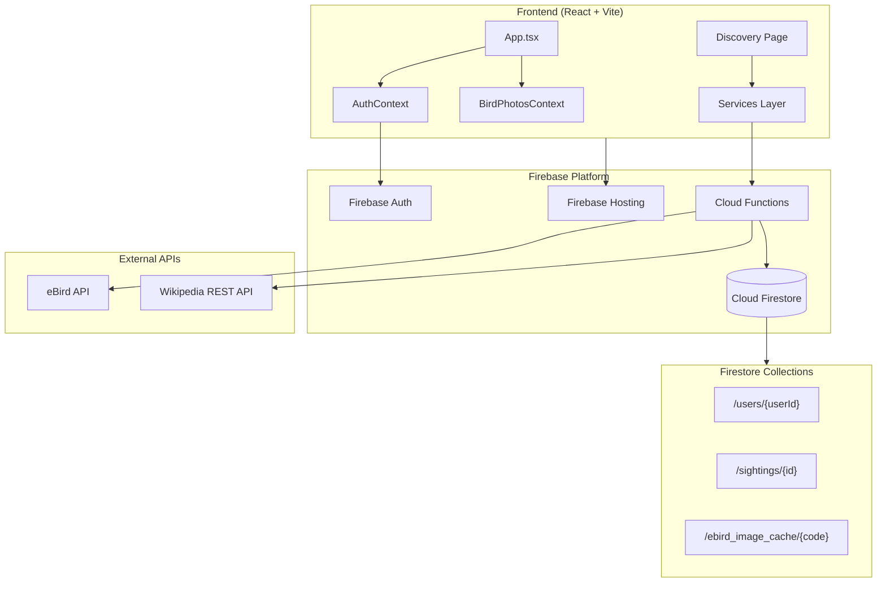

# **Technical Design Document: Birdspotting V2**

Version: 1.1  
Date: January 8, 2026  
Status: Active Development

## **1. Introduction**

This document outlines the technical architecture, tools, and standards for the Birdspotting V2 web application. It serves as a guide for the development team to ensure consistency, scalability, and maintainability.

## **2. Technology Stack**

### **2.1. Architecture Overview**



### **2.2. Frontend**

- **Framework**: React 18 with TypeScript
- **Build Tool**: Vite 5
- **UI Framework**: Material-UI (MUI) v5
  - Custom theme with gradient styles
  - Responsive `AppBar` navigation
  - Material Icons library
- **Routing**: React Router v6
- **State Management**: React Hooks + Context API
  - `AuthContext`: Authentication state and user info
  - `BirdPhotosContext`: Photo cache and request batching
  - `useGeolocation`: Location state and permissions

### **2.3. Backend (Firebase)**

| Service | Purpose |
|---------|---------|
| **Authentication** | Google Sign-in for low-friction onboarding |
| **Firestore** | NoSQL database for users, sightings, and cache |
| **Hosting** | Static asset deployment |
| **Analytics** | Track KPIs defined in PRD |
| **Cloud Functions** | Serverless API proxy and background processing |

### **2.4. Development Environment**

- **Language**: TypeScript across entire codebase
- **Node.js**: v20+ (managed via `.nvmrc`)
- **Package Manager**: npm
- **Configuration**: `.env` files for API keys and Firebase settings
- **Dev Server**: Vite with Hot Module Replacement (HMR)

---

## **3. External API Integrations**

### **3.1. eBird API**

- **Purpose**: Fetch recent bird sightings for the Discovery page
- **Endpoint**: `https://api.ebird.org/v2/data/obs/geo/recent`
- **Implementation**: Cloud Functions proxy keeps API key secure
- **Caching**: Sightings cached in Firestore for 30 minutes

### **3.2. Wikipedia REST API**

- **Purpose**: Fetch bird photos for display
- **Endpoint**: `https://en.wikipedia.org/api/rest_v1/page/summary/{title}`
- **Lookup Strategy**: Scientific name (primary) → Common name (fallback)
- **Rate Limiting**: 100ms delay between requests (polite client)
- **User-Agent**: Custom header per Wikipedia API policy

---

## **4. Data Models**

### **4.1. User (`/users/{userId}`)**

```typescript
interface User {
  uid: string;                    // Firebase Auth UID
  email: string;                  // User email
  displayName: string;            // From Google profile
  photoURL?: string;              // Profile photo
  createdAt: Timestamp;           // Account creation
  lastLoginAt: Timestamp;         // Last login
}
```

### **4.2. Sighting (`/sightings/{sightingId}`)**

```typescript
interface Sighting {
  userId: string;                 // Owner reference
  speciesCode: string;            // eBird species code
  comName: string;                // Common name
  sciName: string;                // Scientific name
  obsDt: Timestamp;               // Observation time
  location: GeoPoint;             // GPS coordinates
  locName: string;                // Location name
  notes?: string;                 // User notes
  photoUrl?: string;              // User photo URL
  createdAt: Timestamp;
  updatedAt: Timestamp;
}
```

### **4.3. BirdImageCache (`/ebird_image_cache/{speciesCode}`)**

```typescript
type PhotoStatus = 'PENDING' | 'PROCESSING' | 'COMPLETED' | 'FAILED';

interface BirdImageCacheDoc {
  speciesCode: string;            // Document ID
  comName: string;
  sciName: string;
  status: PhotoStatus;
  thumbnailUrl: string | null;    // ~320px thumbnail
  originalUrl: string | null;     // Full resolution
  imageUrl: string | null;        // Deprecated: legacy compat
  createdAt: Timestamp;
  updatedAt: Timestamp;
  processAfter?: Timestamp;       // For retry backoff
  priority: number;               // Higher = processed sooner
  errorCount: number;
  lastError?: string;
}
```

---

## **5. Security Architecture**

### **5.1. Firestore Security Rules**

```javascript
// Key rules in firestore.rules:
// - All operations require authentication
// - Users can only write to their own documents
// - Sightings have owner validation on create/update/delete
// - Bird image cache is read-only for clients
```

### **5.2. API Key Security**

- eBird API key stored in Firebase environment config
- Never exposed to client; Cloud Functions act as secure proxy

---

## **6. Background Processing**

### **6.1. Image Queue System**

The `processImageQueue` scheduled function handles asynchronous image fetching:

| Setting | Value |
|---------|-------|
| **Schedule** | Every 5 minutes |
| **Batch Size** | Up to 100 items per run |
| **Rate Limit** | 100ms between Wikipedia requests |
| **Max Retries** | 3 attempts before FAILED status |
| **Timeout** | 120 seconds |

### **6.2. Request Flow**

1. Client requests photos via `getBirdPhotos` Cloud Function
2. Function checks cache; returns immediately if COMPLETED
3. For cache misses, creates PENDING entry
4. `processImageQueue` picks up PENDING items by priority
5. Fetches from Wikipedia, updates cache to COMPLETED
6. Client receives photo on next request/refresh

---

## **7. Code Patterns & Standards**

### **7.1. Shared Utilities**

Common functions are extracted to `/functions/src/lib/` to avoid duplication:

| Utility | Location | Used By |
|---------|----------|---------|
| `normalizeOldCacheEntry` | `lib/cacheUtils.ts` | `getBirdPhotos`, `processImageQueue` |
| `isHybridSpecies` | `lib/cacheUtils.ts` | `processImageQueue` |
| `admin`, `db` | `lib/admin.ts` | All cloud functions |

### **7.2. Error Handling**

- Cloud Functions should catch and log all errors
- Return user-friendly error messages via `HttpsError`
- Use exponential backoff for retryable failures

### **7.3. Type Sharing**

Types are currently defined in `/functions/src/types/index.ts`. When frontend needs these types, either:
- Duplicate with a `// Synced from functions/src/types` comment, or
- Create a shared package (future enhancement)

---

## **8. Testing Strategy**

### **8.1. Local Development**

```bash
# Start Firebase emulators
firebase emulators:start

# Run frontend dev server
cd app && npm run dev
```

### **8.2. Unit Tests**

- Framework: Vitest (frontend), Jest (functions)
- Mock Firebase services for isolation
- Target: >80% coverage on business logic

### **8.3. Integration Tests**

- Use Firebase Emulator Suite
- Test Cloud Function → Firestore interactions
- Verify security rules with test scenarios

---

## **9. Deployment**

### **9.1. Commands**

```bash
# Deploy everything
firebase deploy

# Deploy only functions
firebase deploy --only functions

# Deploy only hosting
firebase deploy --only hosting

# Deploy only Firestore rules
firebase deploy --only firestore:rules
```

### **9.2. Environment Configuration**

```bash
# Set eBird API key
firebase functions:config:set ebird.api_key="YOUR_KEY"

# View current config
firebase functions:config:get
```

### **9.3. Staging vs Production**

Use Firebase project aliases:

```bash
# Use staging
firebase use staging

# Use production
firebase use production
```
